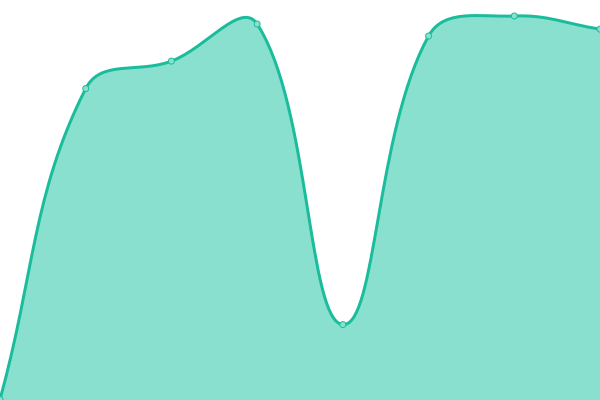

# [📈 Live Status](https://demo): <!--live status--> **🟧 Partial outage**

This repository contains the open-source uptime monitor and status page for [Upptime](https://upptime.js.org), powered by [Upptime](https://github.com/upptime/upptime).

With [Upptime](https://upptime.js.org), you can get your own unlimited and free uptime monitor and status page, powered entirely by a GitHub repository. We use [Issues](https://github.com/upptime/upptime/issues) as incident reports, [Actions](https://github.com/lequan2909/uptime/actions) as uptime monitors, and [Pages](https://demo) for the status page.

<!--start: status pages-->
<!-- This summary is generated by Upptime (https://github.com/upptime/upptime) -->
<!-- Do not edit this manually, your changes will be overwritten -->
<!-- prettier-ignore -->
| URL | Status | History | Response Time | Uptime |
| --- | ------ | ------- | ------------- | ------ |
|  [Alist](https://dl.alisttr.top) | 🟥 Down | [alist.yml](https://github.com/lequan2909/uptime/commits/HEAD/history/alist.yml) | 

 0ms
     
 | 

<a href="https://lequan2909.github.io/uptime/history/alist">0.00%</a>
    

|  [OneDrive Index](https://onedrive.alisttr.top) | 🟩 Up | [one-drive-index.yml](https://github.com/lequan2909/uptime/commits/HEAD/history/one-drive-index.yml) | 

 249ms
     
 | 

<a href="https://lequan2909.github.io/uptime/history/one-drive-index">100.00%</a>
    

|  [edu.x88.one](https://edu.x88.one) | 🟥 Down | [edu-x88-one.yml](https://github.com/lequan2909/uptime/commits/HEAD/history/edu-x88-one.yml) | 

 913ms
     
 | 

<a href="https://lequan2909.github.io/uptime/history/edu-x88-one">96.10%</a>
    

|  [Backup](https://alive-pen-trung27031.koyeb.app) | 🟥 Down | [backup.yml](https://github.com/lequan2909/uptime/commits/HEAD/history/backup.yml) | 

 265ms
     
 | 

<a href="https://lequan2909.github.io/uptime/history/backup">0.00%</a>
    

|  [x88](https://edu.x88.one/) | 🟥 Down | [x88.yml](https://github.com/lequan2909/uptime/commits/HEAD/history/x88.yml) | 

 870ms
     
 | 

<a href="https://lequan2909.github.io/uptime/history/x88">96.07%</a>
    

|  [PC](https://pc.tailb415a.ts.net) | 🟩 Up | [pc.yml](https://github.com/lequan2909/uptime/commits/HEAD/history/pc.yml) | 

 1263ms
     
 | 

<a href="https://lequan2909.github.io/uptime/history/pc">23.10%</a>
    

<!--end: status pages-->

[**Visit our status website →**](https://demo)

## 📄 License

- Powered by: [Upptime](https://github.com/upptime/upptime)
- Code: [MIT](./LICENSE) © [Anand Chowdhary](https://anandchowdhary.com), supported by [Pabio](https://pabio.com)
- Data in the `./history` directory: [Open Database License](https://opendatacommons.org/licenses/odbl/1-0/)
